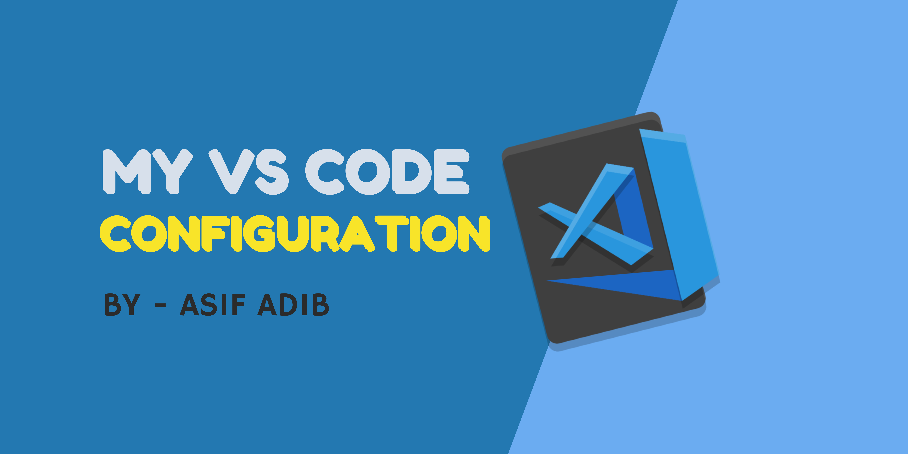

# 💻 MY VS CODE CONFIGURATION
My VS Code Configuration including Extensions, Color Themes, File Icon Theme, Fonts and Json Config.


## Table of Contents 💻

- [Extensions](#extensions-i-use)
- [Color Themes](#color-themes-i-use)
- [File Icon Theme](#file-icon-theme-i-use)
- [Fonts](#fonts-i-use)
- [Json Configuration](#Json-configuration)


## Extensions I use ⚙

- [Auto Close Tag](https://marketplace.visualstudio.com/items?itemName=formulahendry.auto-close-tag)
- [Auto Rename Tag](https://marketplace.visualstudio.com/items?itemName=formulahendry.auto-rename-tag)
- [Beautify](https://marketplace.visualstudio.com/items?itemName=HookyQR.beautify)
- [Bracket Pair Colorizer](https://marketplace.visualstudio.com/items?itemName=CoenraadS.bracket-pair-colorizer)
- [Color Highlight](https://marketplace.visualstudio.com/items?itemName=naumovs.color-highlight)
- [Highlight Matching Tag](https://marketplace.visualstudio.com/items?itemName=vincaslt.highlight-matching-tag)
- [HTML CSS Support](https://marketplace.visualstudio.com/items?itemName=ecmel.vscode-html-css)
- [JavaScript (ES6) code snippets](https://marketplace.visualstudio.com/items?itemName=xabikos.JavaScriptSnippets)
- [Live Server](https://marketplace.visualstudio.com/items?itemName=ritwickdey.LiveServer)
- [Path Intellisense](https://marketplace.visualstudio.com/items?itemName=christian-kohler.path-intellisense)
- [Code formatter](https://marketplace.visualstudio.com/items?itemName=esbenp.prettier-vscode)
- [Project Manager](https://marketplace.visualstudio.com/items?itemName=alefragnani.project-manager)
- [Live Sass Compiler](https://marketplace.visualstudio.com/items?itemName=ritwickdey.live-sass)
- [Code Runner](https://marketplace.visualstudio.com/items?itemName=formulahendry.code-runner)
- [Code Spell Checker](https://marketplace.visualstudio.com/items?itemName=streetsidesoftware.code-spell-checker)
- [IntelliSense for CSS class names in HTML](https://marketplace.visualstudio.com/items?itemName=Zignd.html-css-class-completion)
- [Settings Sync](https://marketplace.visualstudio.com/items?itemName=Shan.code-settings-sync)
- [Tabnine AI Code Completion](https://marketplace.visualstudio.com/items?itemName=TabNine.tabnine-vscode)


## Color Themes I use 🌈

- [Learn with Sumit Theme](https://marketplace.visualstudio.com/items?itemName=SumitSaha.learn-with-sumit-theme)
- [Andromeda](https://marketplace.visualstudio.com/items?itemName=EliverLara.andromeda)
- [Cobalt2 Theme Official](https://marketplace.visualstudio.com/items?itemName=wesbos.theme-cobalt2)


## File Icon Theme I use 📁

- [VS Code Icons](https://marketplace.visualstudio.com/items?itemName=vscode-icons-team.vscode-icons)
- [Material Icon Theme](https://marketplace.visualstudio.com/items?itemName=PKief.material-icon-theme)
- [File Icons](https://marketplace.visualstudio.com/items?itemName=file-icons.file-icons)


## Fonts I use 🌠 

- [JetBrains Mono](https://www.jetbrains.com/lp/mono)
- [Anonymous Pro](https://www.marksimonson.com/fonts/view/anonymous-pro)
- [MonoLisa](https://www.monolisa.dev)
- [Fira Code](https://github.com/tonsky/FiraCode)


## Json Configuration 🛠

```json
{
  //Code Editor Some Important Setting
  "workbench.startupEditor": "newUntitledFile",
  "editor.wordWrap": "on",
  "editor.minimap.maxColumn": 50,
  "editor.fontFamily": "JetBrains Mono, 'Fira Code', Roboto",
  "editor.fontSize": 16,
  "editor.fontLigatures": true,

  "files.autoSave": "afterDelay",
  "workbench.colorTheme": "Learn with Sumit - Peace of the eye",
  "workbench.iconTheme": "vscode-icons",
  "workbench.editor.enablePreview": false,


  // Comment Text Style
  "editor.tokenColorCustomizations": {
    "textMateRules": [
      {
        "scope": "comment",
        "settings": {
          "fontStyle": "italic"
        }
      }
    ]
  },


  // Cursor Setting
  "editor.cursorSmoothCaretAnimation": true,
  "editor.cursorBlinking": "expand",


  // Terminal Setting
  "terminal.integrated.shell.windows": "C:\\Program Files\\Git\\bin\\bash.exe",


  // Live Sass Compailer Setting
  "liveSassCompile.settings.generateMap": false,
  "liveSassCompile.settings.formats": [
    {
      "format": "compressed",
      "extensionName": ".min.css",
      "savePath": "/css"
    }
  ],
  "liveSassCompile.settings.autoprefix": [],
  "liveSassCompile.settings.excludeList": ["**/node_modules/**", ".vscode/**"],


  // Code Runner Setting
  "code-runner.runInTerminal": true,


  // Config related to code formatting
  "editor.defaultFormatter": "esbenp.prettier-vscode",
  "editor.formatOnSave": true,
  "[javascript]": {
    "editor.formatOnSave": false
  },
  "[javascriptreact]": {
    "editor.formatOnSave": false
  },
  "editor.codeActionsOnSave": {
    "source.fixAll.eslint": true,
    "source.fixAll.tslint": true,
    "source.organizeImports": true
  },
  "eslint.alwaysShowStatus": true,
  "prettier.disableLanguages": ["javascript", "javascriptreact"],

  // TabNine intelicense
  "tabnine.experimentalAutoImports": true,

}
```